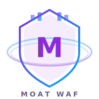

# Moat WAF

<div align="center">



**轻量级、现代化、自托管 Web 应用防火墙**

[English](README_EN.md) | 中文

</div>

---

## 产品简介

Moat WAF 是一款基于 OpenResty (nginx + Lua) 的 Web 应用防火墙，为 Web 应用提供 HTTP/HTTPS 流量检测、威胁识别和请求过滤能力。

### 核心特性

- **多层检测引擎** — PCRE 正则匹配 + YAML 规则定义，覆盖 SQL 注入、XSS、路径遍历、命令注入、SSRF 等 9 类攻击
- **CC 防护** — IP 级 QPS 限制、连接数限制、JS Challenge 挑战模式
- **IP 管控** — 黑白名单、TTL 自动过期、地理封禁
- **可视化管理** — Neon Cyberpunk 风格管理面板，Chart.js 数据图表，日志实时流查看
- **规则在线编辑** — Web 界面管理自定义规则，支持搜索、测试、命中统计
- **Nginx 配置管理** — 在线编辑 nginx.conf，语法检查，热重载
- **多语言支持** — 简体中文 / 繁体中文 / English，自动检测浏览器语言
- **零外部依赖** — 无数据库、无外部服务，单容器运行，资源占用极低

---

## 快速部署

### Docker 一键部署

```bash
docker run -d --name moat-waf \
  -p 8080:80 \
  -e WAF_BACKEND=your-backend-ip:80 \
  -e WAF_ADMIN_TOKEN=your-secure-token-min-32-chars \
  angelababa/moat-waf:latest
```

### 环境变量

| 变量 | 说明 | 默认值 |
|------|------|--------|
| `WAF_BACKEND` | 后端服务器地址 | `127.0.0.1:80` |
| `WAF_ADMIN_TOKEN` | 管理面板访问令牌（至少32字符） | 必填 |
| `WAF_ADMIN_PATH` | 管理面板路径 | `/admin/` |
| `WAF_HEALTH_PATH` | 健康检查路径 | `/waf-health` |
| `WAF_MAX_UPLOAD_SIZE` | 最大上传文件大小 | `10m` |
| `WAF_LOG_DIR` | 日志目录 | `/opt/moat/logs` |

### 访问管理面板

1. 浏览器打开 `http://your-server:8080/admin/`
2. 输入 `WAF_ADMIN_TOKEN` 登录
3. 在仪表盘查看实时数据、管理规则、查看日志

### Docker 构建

```bash
git clone <repository-url>
cd moat-waf
docker build -t angelababa/moat-waf:latest .
docker run -d --name moat-waf \
  -p 8080:80 \
  -e WAF_BACKEND=192.168.1.100:80 \
  -e WAF_ADMIN_TOKEN=your-secure-token-here \
  angelababa/moat-waf:latest
```

---

## 项目结构

```
├── conf/                    # nginx 配置和规则文件
│   ├── nginx.conf           # 主配置（环境变量占位符）
│   ├── rules/               # WAF 规则集（YAML 格式）
│   │   ├── sql_injection.yaml
│   │   ├── xss.yaml
│   │   ├── path_traversal.yaml
│   │   └── custom.yaml      # 自定义规则
│   ├── ip_blacklist.txt     # IP 黑名单
│   ├── ip_whitelist.txt     # IP 白名单
│   └── geo_block.txt        # 地理封禁
├── lib/                     # 核心 Lua 模块
│   ├── waf.lua              # WAF 处理管线
│   ├── rule_engine.lua      # 规则引擎
│   ├── cc_protect.lua       # CC 防护
│   ├── ip_control.lua       # IP 管控
│   ├── logger.lua           # 日志模块
│   ├── upload_check.lua     # 上传检查
│   └── admin/               # 管理面板模块
│       ├── html.lua         # 前端模板
│       ├── dashboard.lua    # 仪表盘 API
│       ├── logs.lua         # 日志 API
│       ├── rules.lua        # 规则管理 API
│       ├── nginx.lua        # nginx 配置 API
│       └── challenge.lua    # JS Challenge
├── static/                  # 静态资源（Logo、Chart.js、字体）
├── scripts/                 # 辅助脚本
├── docs/                    # 文档
├── Dockerfile
├── docker-entrypoint.sh
└── README.md
```

---

## 开源许可

本项目采用 MIT 许可证开源。
