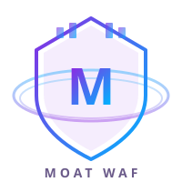

# Moat WAF

<div align="center">



**轻量级、现代化、自托管 Web 应用防火墙**

[English](README_EN.md) | 中文

</div>

---

## 产品简介

Moat WAF 是一款基于 OpenResty (nginx + Lua) 的 Web 应用防火墙，为 Web 应用提供 HTTP/HTTPS 流量检测、威胁识别和请求过滤能力。

### 核心特性

- **多层检测引擎** — PCRE 正则匹配 + YAML 规则定义，覆盖 SQL 注入、XSS、路径遍历、命令注入、SSRF 等 9 类攻击
- **CC 防护** — IP 级 QPS 限制、连接数限制、JS Challenge 挑战模式
- **IP 管控** — 黑白名单、TTL 自动过期、地理封禁
- **可视化管理** — Neon Cyberpunk 风格管理面板，Chart.js 数据图表，日志实时流查看
- **规则在线编辑** — Web 界面管理自定义规则，支持搜索、测试、命中统计
- **Nginx 配置管理** — 在线编辑 nginx.conf，语法检查，热重载
- **多语言支持** — 简体中文 / 繁体中文 / English，自动检测浏览器语言
- **零外部依赖** — 无数据库、无外部服务，单容器运行，资源占用极低

---

## 快速部署

### Docker 一键部署

```bash
docker run -d --name moat-waf \
  -p 8080:80 \
  -e WAF_BACKEND=your-backend-ip:80 \
  -e WAF_ADMIN_TOKEN=your-secure-token-min-32-chars \
  angelababa/moat-waf:latest
```

### 环境变量

| 变量 | 说明 | 默认值 |
|------|------|--------|
| `WAF_BACKEND` | 后端服务器地址 | `127.0.0.1:80` |
| `WAF_ADMIN_TOKEN` | 管理面板访问令牌（至少32字符） | 必填 |
| `WAF_ADMIN_PATH` | 管理面板路径 | `/admin/` |
| `WAF_HEALTH_PATH` | 健康检查路径 | `/waf-health` |
| `WAF_MAX_UPLOAD_SIZE` | 最大上传文件大小 | `500m` |
| `WAF_UPLOAD_SCAN_LIMIT` | 全量内容扫描阈值，超过该大小的上传只做扩展名/魔数前缀检查 | `20m` |
| `WAF_MODE` | 运行模式：`block`（拦截）或 `log_only`（仅记录） | `block` |
| `WAF_CC_CHALLENGE_ENABLED` | 启动时默认开启 JS Challenge（`true`/`false`）；面板运行时修改仍可覆盖，重启后回到该默认值 | `false` |
| `WAF_LOG_DIR` | 日志目录 | `/opt/moat/logs` |

### 访问管理面板

1. 浏览器打开 `http://your-server:8080/admin/`
2. 输入 `WAF_ADMIN_TOKEN` 登录
3. 在仪表盘查看实时数据、管理规则、查看日志

> 管理面板支持在线编辑 nginx.conf（语法检查 + 热重载）与切换运行模式（block / log_only）。
> 容器重建会丢失面板内修改，生产环境请用 `-v` 把 `/opt/moat/conf/nginx.conf` 挂载到宿主机持久化。

### Host 白名单（waf_allowed_hosts）

Moat WAF 会对每个请求的 `Host` 头做校验：不在白名单内的域名一律返回 403
（用于防止 DNS rebinding / Host 头注入 / 其他域名解析到本机）。该校验与运行模式无关，永远生效。

- 在 nginx 的每个 server 块中通过 `set $waf_allowed_hosts "example.com,foo.com";` 配置；
- 支持 **后缀匹配**：`example.com` 会同时放行 `example.com` 与所有 `*.example.com` 子域名；
  也支持显式通配 `*.example.com`（仅子域名）与精确域名 `www.example.com`；
- 多个域名用英文逗号分隔，大小写不敏感。

示例（反代多个域名时）：

```nginx
server {
    listen 443 ssl http2;
    server_name *.example.com;
    set $waf_allowed_hosts "example.com";   # 放行所有 *.example.com

    location / {
        rewrite_by_lua_block { local waf = require("lib.waf"); waf.rewrite_phase() }
        access_by_lua_block  { local waf = require("lib.waf"); waf.access_phase() }
        proxy_pass http://127.0.0.1:8080;
    }
}
```

### 上传检查（Upload Inspection）

- `WAF_MAX_UPLOAD_SIZE` 是上传的硬性上限（默认 `500m`），超过直接返回 403（**不受 log_only 影响**）；
  请同时把 nginx 的 `client_max_body_size` 调整到不小于该值；
- 为防止大文件把整个 body 读入 worker 内存，超过 `WAF_UPLOAD_SCAN_LIMIT`（默认 `20m`）的
  multipart 上传只做 **扩展名 + 魔数前缀** 检查（危险扩展名 / 可执行文件），跳过全量内容
  （shell 代码）扫描；`20m` 以内的上传仍执行完整校验。
- multipart 上传请求**不参与 BODY 类正则规则**（CMDI / SQLI / XSS 等）：文件二进制内容
  极易命中这类规则造成误报，上传安全统一由上述 upload_check（扩展名 / 魔数 / 大小）负责。
- UPLOAD-004 的**内容 shell 代码扫描只对"无安全扩展名"的文件执行**：图片 / 文档 / 压缩包等
  安全扩展名文件服务器不会当作脚本执行，其原始字节又常包含 `<%`、`eval(` 之类字符，
  扫描只会误报；无扩展名 / 可疑文件仍会做内容扫描作为兜底。

### 安全响应头

Moat WAF 作为反向代理位于任意应用之前，因此**默认不全局下发** CSP / HSTS / X-Frame-Options
等严格安全头（可能破坏业务：内联脚本、CDN、iframe、子域 HSTS）。需要时请在各 server / location
中按需添加：

```nginx
add_header Strict-Transport-Security "max-age=31536000; includeSubDomains" always;
add_header Content-Security-Policy "default-src 'self'" always;
```

### Docker 构建

```bash
git clone https://github.com/ligg/moatwaf.git
cd moat-waf
docker build -t angelababa/moat-waf:latest .
docker run -d --name moat-waf \
  -p 8080:80 \
  -e WAF_BACKEND=192.168.1.100:80 \
  -e WAF_ADMIN_TOKEN=your-secure-token-here \
  angelababa/moat-waf:latest
```

---

## 项目结构

```
├── conf/                    # nginx 配置和规则文件
│   ├── nginx.conf           # 主配置（环境变量占位符）
│   ├── rules/               # WAF 规则集（YAML 格式）
│   │   ├── sql_injection.yaml
│   │   ├── xss.yaml
│   │   ├── path_traversal.yaml
│   │   └── custom.yaml      # 自定义规则
│   ├── ip_blacklist.txt     # IP 黑名单
│   ├── ip_whitelist.txt     # IP 白名单
│   └── geo_block.txt        # 地理封禁
├── lib/                     # 核心 Lua 模块
│   ├── waf.lua              # WAF 处理管线
│   ├── rule_engine.lua      # 规则引擎
│   ├── cc_protect.lua       # CC 防护
│   ├── ip_control.lua       # IP 管控
│   ├── logger.lua           # 日志模块
│   ├── upload_check.lua     # 上传检查
│   └── admin/               # 管理面板模块
│       ├── html.lua         # 前端模板
│       ├── dashboard.lua    # 仪表盘 API
│       ├── logs.lua         # 日志 API
│       ├── rules.lua        # 规则管理 API
│       ├── nginx.lua        # nginx 配置 API
│       └── challenge.lua    # JS Challenge
├── static/                  # 静态资源（Logo、Chart.js、字体）
├── scripts/                 # 辅助脚本
├── docs/                    # 文档
├── Dockerfile
├── docker-entrypoint.sh
└── README.md
```

---

## 开源许可

本项目采用 MIT 许可证开源。
